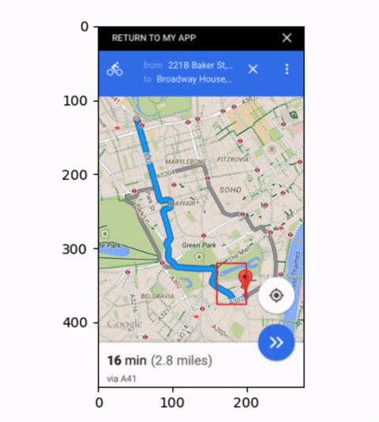
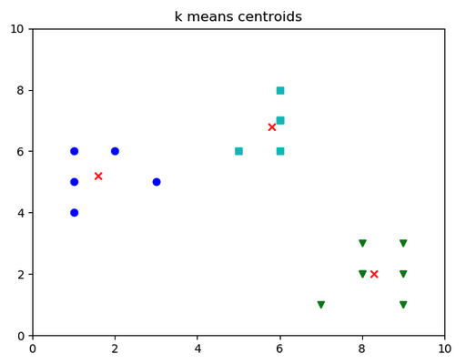
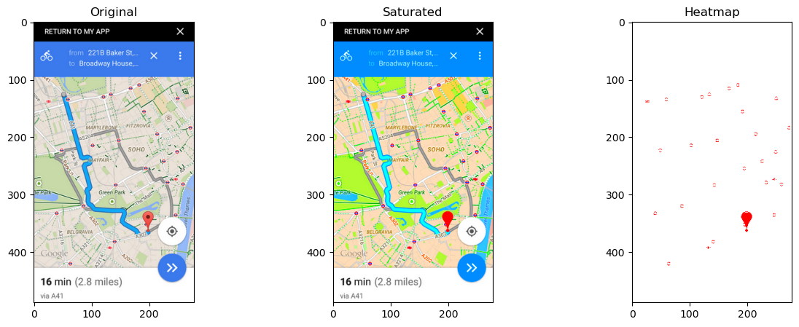
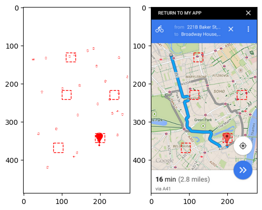
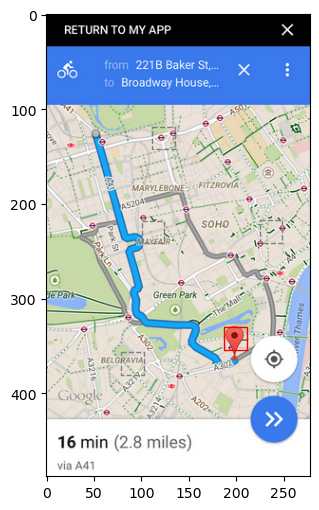

# Visual Scanning Demo

- Start Date: 2024-07-02
- RFC PR: (leave this empty)
- Iot Issue: (leave this empty)

## Summary

<!-- One paragraph explanation of the feature. -->

Recently we found some difficulties in finding the target item to click on while 
testing the Operational Map. The Operational Map application accessed through
the desktop uses a `<canvas/>` element to render the map and nothing more,
making difficult to find the correct place to click and proceed with the test.

The proposed solution consists of taking a screenshot of the screen and using
computer vision techniques to find the target pin.

Please refer to "002_visual_scanning_cluster.ipynb" notebook [[5]](./002_visual_scanning_cluster.ipynb) for the final solution.

## Motivation

<!-- Why are we doing this? What use cases does it support? What is the expected
outcome? -->

When we are testing the Operational Map either on the destkop or mobile
application, we have limited access to what is being rendered inside the map.
Due to this difficulty, we decided to try a different approach by analyzing
the screenshot of the application and estimating the coordinates for the
testing framework to use.

By using algorithms such as heatmapping and clustering, we were able to
determine the position of the target pin without accessing the page content,
allowing us to automate tests involving the use of maps.

## Detailed design

<!-- This is the bulk of the RFC. Explain the design in enough detail for somebody
familiar with the project to understand, and for somebody familiar with the
implementation to implement. This should get into specifics and corner-cases,
and include examples of how the feature is used. Any new terminology should be
defined here. -->

### Brute force approach

The basic idea consists of cropping a small piece of the original image
and comparing with the target, trying to estimate how similar both 
pieces are. The process should go through all the original image until 
it finds a good enough candidate.

The initial approach followed this idea by cutting each piece and
calculating the similarity between them by the euclidian distance formula [[1]](https://en.wikipedia.org/wiki/Euclidean_distance).

The Figure 1 below shows how the algorithm scanning the image until it finds
the target pin:

Figure 1 - Visual representation of an image being scanned.

You can find the implementation of this approach in the notebook "001_visual_scanning_brute_force" [[2]](./001_visual_scanning_brute_force.ipynb).

### Using cluster algorithm to find the pin

Unfortunately the algorithm took 1 min 52 sec on average to converge,
which is a very long time for such a small image of 278px x 488px.

With this information, we proceeded to find a better approach for this problem.
we were able to find an optimal solution by applying Data Science techniques 
to prepare the data before being analyzed. For the analysis, instead of 
comparing each pixel between both images, we applied the Kmeans++ Cluster Algorithm [[3]](https://en.wikipedia.org/wiki/K-means%2B%2B) to find clusters in the image
and the central coordinates for these groups.

These central coordinates, called centroids, are the arithmetic mean position of 
all the points in the surface of the figure. it can be understood as the point at which a cutout of the shape (with uniformly distributed mass) could be perfectly balanced on the tip of a pin. [[4]](https://en.wikipedia.org/wiki/Centroid).

The Figure 2 below shows three centroids (represented as X) in a distribution
with three different concentration of points:

Figure 2 - Cluster example.

With the centroids, we were able to estimate the best coordinate to perform 
the click in 0.4s on average. The implementation of this approach using Python
can be accessed in "002_visual_scanning_cluster.ipynb" notebook [[5]](./002_visual_scanning_cluster.ipynb).

The Figure 3 shows the process we used to create a heatmap. First, we
saturate the map to reduce the number of colors, then we create the
heatmap by keeping only the color that exist in our target pin (red) and 
removing all else (represented by the white color):

Figure 3 - Process of creating the heatmap.

Next, we apply the clustering algorithm to find all concentrations of HOT
pixels in our heatmap. The Figure 4 shows all possible places our ping
might be:

Figure 4 - Finding cluster in a heatmap.

Finally, we calculate the similarity between each cluster area with our target
pin. The result is called distance, as in "euclidian distance" and denotes
how close an image is to each other. The Figure 5 below shows the closest
cluster in a red rectangle, whereas the others are represented by the gray
dotted rectangles:

Figure 5 - Choosing the correct cluster.

## How We Teach This / How We introduce it

<!-- What names and terminology work best for these concepts and why? How is this
idea best presented? As a continuation of existing patterns, or as a
wholly new one? -->

<!-- Would the acceptance of this proposal mean the guides must be
re-organized or altered? -->

<!-- How should this feature be introduced? -->

We used Jupyter Notebook and Python programming language to iterate faster on
the problem and to allow us explore different avenues before proposing a final
solution. The next step would be to transfer this solution to our testing framework,
which is either written in Java (for overall mobile tests) or Javascript (few applications such as Civil Defects App and Operational Maps app).

## Drawbacks

<!-- Why should we *not* do this? Please consider the impact on ...,
on the integration of this feature with other existing and planned features,
on the impact of the API churn on existing apps, etc. -->

<!-- There are tradeoffs to choosing any path, please attempt to identify them here. -->

## Alternatives

<!-- What other designs have been considered? What is the impact of not doing this? -->

<!-- This section could also include prior art, that is, how other projects in the same domain have solved this problem. -->

Whenever possible, the best alternative would be to have full control of the data
coming to the application and changing it in a way that would allow the framework
to quickly find the path we wish to go. By intercepting the requests [[5]](https://docs.cypress.io/api/commands/intercept) and using mocks [[6]](https://www.baeldung.com/mockito-annotations) with known pin coordinates, we are able to control the flow
of the test and create assertive test cases for our application.

Other alternative would be to add a UI elements or other accessibility features that would allow the framework to navigate through the application with
ease. Elements such as drawers [[7]](https://pages.github.ibm.com/maximo-app-framework/graphite/main/react/storybook/?path=/story/components-%F0%9F%96%A5-%F0%9F%91%86-slidingdrawer--slidingdrawer) and lists [[8]](https://pages.github.ibm.com/maximo-app-framework/graphite/main/react/storybook/?path=/story/components-%F0%9F%96%A5-%F0%9F%91%86-datalist--simple-datalist) would give the additional support needed for the automation tools to find the correct items to go
next for their test cases.

The solution proposed in the project is meant to be another alternative to have
on our working belt, for cases where we find ourselves with very limited control
over data and the interface we want to test.

## Unresolved questions

<!-- Optional, but suggested for first drafts. What parts of the design are still
TBD? -->

The next step would be to continuing evaluating the tool by testing different 
scenarios until it satisfies all Project's requirements. Once we have a fine-tuned
solution, we can proceed with the implementation of it in either Java or Javascript,
depending on the framework we are in.

<!-- 
Generate diagrams:
$ plantuml src/*.puml -o ../assets -tsvg;
-->

## References

1. https://en.wikipedia.org/wiki/Euclidean_distance
2. ./001_visual_scanning_brute_force.ipynb
3. Wikipedia - k-means++. Available in: https://en.wikipedia.org/wiki/K-means%2B%2
4. Wikipedia - Centroid. Available in: https://en.wikipedia.org/wiki/Centroid
5. Cypress - Intercept. Available in: https://docs.cypress.io/api/commands/intercept
6. Baeldung - Getting Started With Mockito @Mock. Available in: https://www.baeldung.com/mockito-annotations
7. Graphite Storybook - SlidingDrawer element. Available in: https://pages.github.ibm.com/maximo-app-framework/graphite/main/react/storybook/?path=/story/components-%F0%9F%96%A5-%F0%9F%91%86-slidingdrawer--slidingdrawer
8. Graphite Storybook - Simple Datalist. Available in: https://pages.github.ibm.com/maximo-app-framework/graphite/main/react/storybook/?path=/story/components-%F0%9F%96%A5-%F0%9F%91%86-datalist--simple-datalist